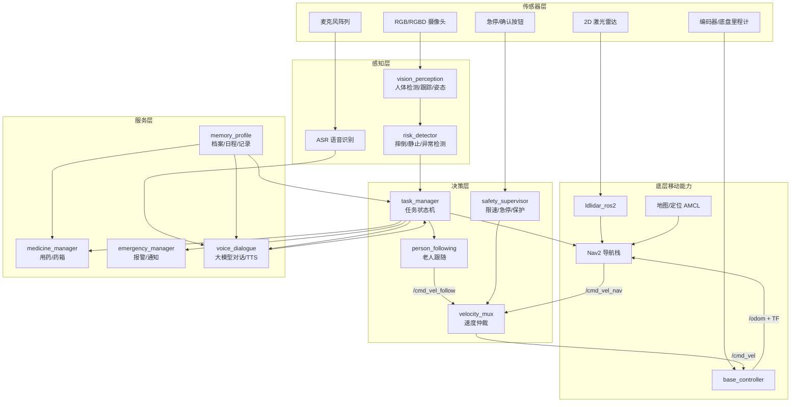
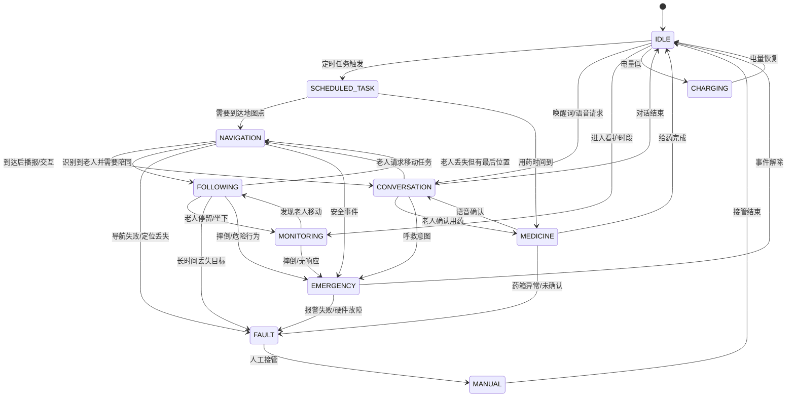
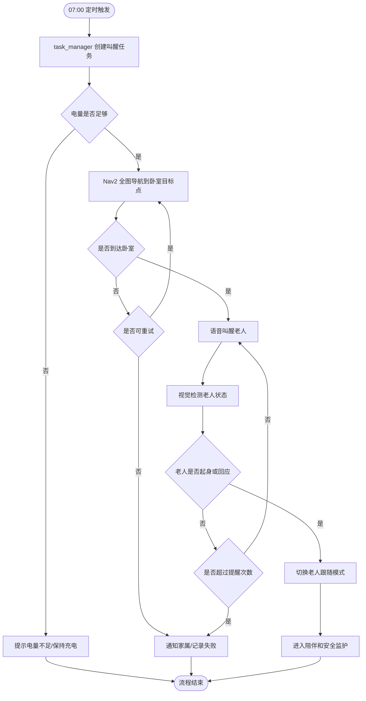
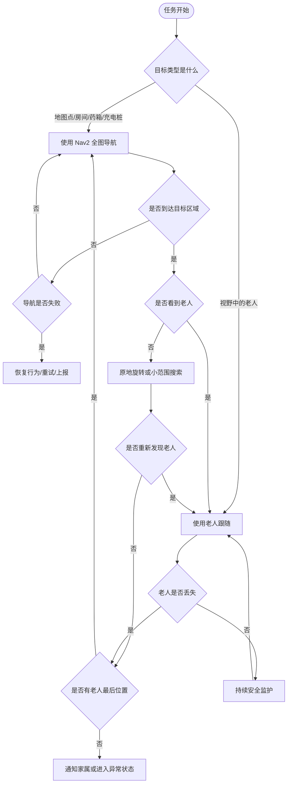
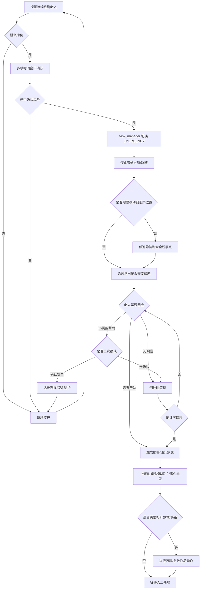
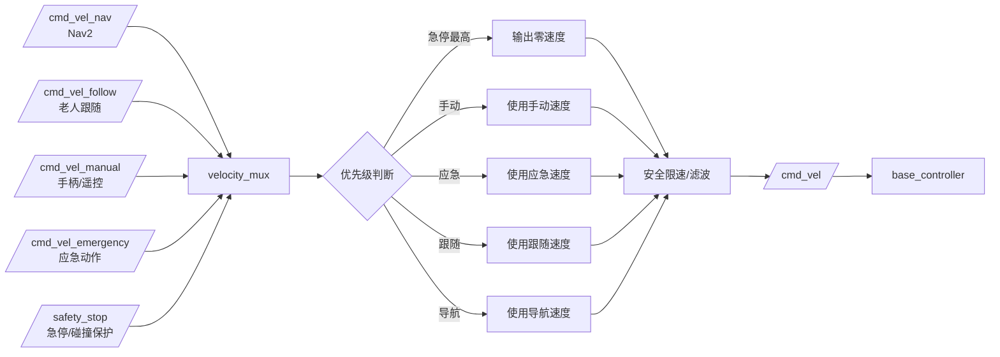
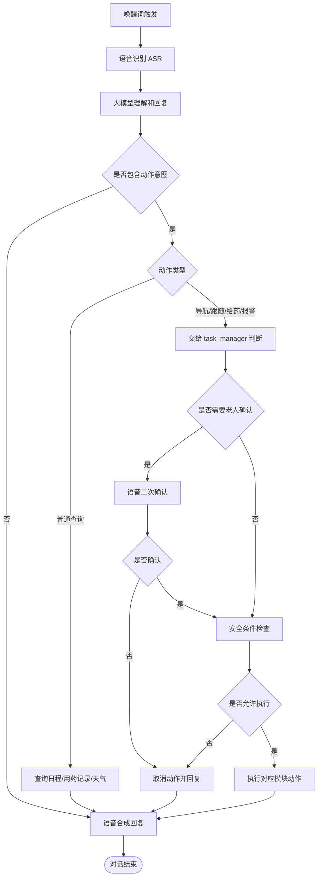

# 养老陪伴型机器人工作流程 Mermaid 图

本文档提供可直接渲染的 Mermaid 图，用于表达项目总体流程、模块关系和关键任务状态机。

## 1. 总体模块架构

```mermaid
flowchart TB
    subgraph Sensors[传感器层]
        Lidar[2D 激光雷达]
        Camera[RGB/RGBD 摄像头]
        Mic[麦克风阵列]
        Encoder[编码器/底盘里程计]
        Button[急停/确认按钮]
    end

    subgraph Base[底层移动能力]
        LidarNode[ldlidar_ros2]
        BaseController[base_controller]
        Nav2[Nav2 导航栈]
        Map[地图/定位 AMCL]
    end

    subgraph Perception[感知层]
        Vision[vision_perception<br/>人体检测/跟踪/姿态]
        Risk[risk_detector<br/>摔倒/静止/异常检测]
        ASR[ASR 语音识别]
    end

    subgraph Decision[决策层]
        Task[task_manager<br/>任务状态机]
        Follow[person_following<br/>老人跟随]
        VelMux[velocity_mux<br/>速度仲裁]
        Safety[safety_supervisor<br/>限速/急停/保护]
    end

    subgraph Service[服务层]
        Medicine[medicine_manager<br/>用药/药箱]
        Emergency[emergency_manager<br/>报警/通知]
        Dialogue[voice_dialogue<br/>大模型对话/TTS]
        Profile[memory_profile<br/>档案/日程/记录]
    end

    Lidar --> LidarNode --> Nav2
    Encoder --> BaseController
    Camera --> Vision --> Risk --> Task
    Mic --> ASR --> Dialogue --> Task
    Button --> Safety

    Map --> Nav2
    Task --> Nav2
    Task --> Follow
    Task --> Medicine
    Task --> Emergency
    Task --> Dialogue
    Profile --> Task
    Profile --> Dialogue
    Profile --> Medicine

    Nav2 -->|/cmd_vel_nav| VelMux
    Follow -->|/cmd_vel_follow| VelMux
    Safety --> VelMux
    VelMux -->|/cmd_vel| BaseController
    BaseController -->|/odom + TF| Nav2
```

## 2. 顶层任务状态机

```mermaid
stateDiagram-v2
    [*] --> IDLE

    IDLE --> SCHEDULED_TASK: 定时任务触发
    IDLE --> CONVERSATION: 唤醒词/语音请求
    IDLE --> MONITORING: 进入看护时段
    IDLE --> CHARGING: 电量低

    SCHEDULED_TASK --> NAVIGATION: 需要到达地图点
    NAVIGATION --> CONVERSATION: 到达后播报/交互
    NAVIGATION --> FOLLOWING: 识别到老人并需要陪同
    NAVIGATION --> FAULT: 导航失败/定位丢失

    MONITORING --> FOLLOWING: 发现老人移动
    FOLLOWING --> MONITORING: 老人停留/坐下
    FOLLOWING --> NAVIGATION: 老人丢失但有最后位置
    FOLLOWING --> FAULT: 长时间丢失目标

    CONVERSATION --> IDLE: 对话结束
    CONVERSATION --> NAVIGATION: 老人请求移动任务
    CONVERSATION --> MEDICINE: 老人确认用药

    SCHEDULED_TASK --> MEDICINE: 用药时间到
    MEDICINE --> CONVERSATION: 语音确认
    MEDICINE --> IDLE: 给药完成
    MEDICINE --> FAULT: 药箱异常/未确认

    MONITORING --> EMERGENCY: 摔倒/无响应
    FOLLOWING --> EMERGENCY: 摔倒/危险行为
    NAVIGATION --> EMERGENCY: 安全事件
    CONVERSATION --> EMERGENCY: 呼救意图

    EMERGENCY --> IDLE: 事件解除
    EMERGENCY --> FAULT: 报警失败/硬件故障

    CHARGING --> IDLE: 电量恢复
    FAULT --> MANUAL: 人工接管
    MANUAL --> IDLE: 接管结束
```

## 3. 早晨叫醒流程

```mermaid
flowchart TD
    Start([07:00 定时触发]) --> CreateTask[task_manager 创建叫醒任务]
    CreateTask --> CheckBattery{电量是否足够}
    CheckBattery -- 否 --> NotifyLowPower[提示电量不足/保持充电]
    CheckBattery -- 是 --> NavBedroom[Nav2 全图导航到卧室目标点]

    NavBedroom --> NavResult{是否到达卧室}
    NavResult -- 否 --> Retry{是否可重试}
    Retry -- 是 --> NavBedroom
    Retry -- 否 --> NotifyFamily[通知家属/记录失败]

    NavResult -- 是 --> WakeVoice[语音叫醒老人]
    WakeVoice --> DetectPerson[视觉检测老人状态]
    DetectPerson --> Awake{老人是否起身或回应}

    Awake -- 是 --> FollowMode[切换老人跟随模式]
    Awake -- 否 --> RepeatWake{是否超过提醒次数}
    RepeatWake -- 否 --> WakeVoice
    RepeatWake -- 是 --> NotifyFamily

    FollowMode --> Monitor[进入陪伴和安全监护]
    NotifyLowPower --> End([流程结束])
    NotifyFamily --> End
    Monitor --> End
```

## 4. 全图导航与老人跟随切换

```mermaid
flowchart TD
    ModeStart([任务开始]) --> TargetType{目标类型是什么}

    TargetType -- 地图点/房间/药箱/充电桩 --> GlobalNav[使用 Nav2 全图导航]
    TargetType -- 视野中的老人 --> Follow[使用老人跟随]

    GlobalNav --> Arrive{是否到达目标区域}
    Arrive -- 否 --> NavFail{导航是否失败}
    NavFail -- 否 --> GlobalNav
    NavFail -- 是 --> Recovery[恢复行为/重试/上报]

    Arrive -- 是 --> PersonVisible{是否看到老人}
    PersonVisible -- 是 --> Follow
    PersonVisible -- 否 --> Search[原地旋转或小范围搜索]

    Search --> Found{是否重新发现老人}
    Found -- 是 --> Follow
    Found -- 否 --> LastKnown{是否有老人最后位置}

    LastKnown -- 是 --> GlobalNav
    LastKnown -- 否 --> Notify[通知家属或进入异常状态]

    Follow --> Lost{老人是否丢失}
    Lost -- 否 --> SafetyMonitor[持续安全监护]
    SafetyMonitor --> Follow

    Lost -- 是 --> LastKnown
```

## 5. 摔倒应急流程

```mermaid
flowchart TD
    VisionFrame[视觉持续检测老人] --> Candidate{疑似摔倒}
    Candidate -- 否 --> Normal[继续监护]
    Normal --> VisionFrame

    Candidate -- 是 --> WindowCheck[多帧时间窗口确认]
    WindowCheck --> Confirmed{是否确认风险}
    Confirmed -- 否 --> Normal

    Confirmed -- 是 --> EmergencyMode[task_manager 切换 EMERGENCY]
    EmergencyMode --> StopMotion[停止普通导航/跟随]
    StopMotion --> SafePose{是否需要移动到观察位置}
    SafePose -- 是 --> NavObserve[低速导航到安全观察点]
    SafePose -- 否 --> AskHelp[语音询问是否需要帮助]
    NavObserve --> AskHelp

    AskHelp --> Response{老人是否回应}
    Response -- 需要帮助 --> Alarm[触发报警/通知家属]
    Response -- 不需要帮助 --> Cancel{是否二次确认}
    Response -- 无响应 --> Countdown[倒计时等待]

    Cancel -- 确认安全 --> LogSafe[记录误报/恢复监护]
    Cancel -- 未确认 --> Countdown

    Countdown --> Timeout{倒计时结束}
    Timeout -- 否 --> Response
    Timeout -- 是 --> Alarm

    Alarm --> Evidence[上传时间/位置/图片/事件类型]
    Evidence --> MedicineBox{是否需要打开急救/药箱}
    MedicineBox -- 是 --> OpenBox[执行药箱/急救物品动作]
    MedicineBox -- 否 --> WaitRescue[等待人工处理]
    OpenBox --> WaitRescue
    LogSafe --> Normal
```

## 6. 速度仲裁流程

```mermaid
flowchart LR
    NavCmd[/cmd_vel_nav<br/>Nav2/] --> Mux[velocity_mux]
    FollowCmd[/cmd_vel_follow<br/>老人跟随/] --> Mux
    ManualCmd[/cmd_vel_manual<br/>手柄/遥控/] --> Mux
    EmergencyCmd[/cmd_vel_emergency<br/>应急动作/] --> Mux
    Stop[/safety_stop<br/>急停/碰撞保护/] --> Mux

    Mux --> Priority{优先级判断}
    Priority -->|急停最高| Zero[输出零速度]
    Priority -->|手动| ManualOut[使用手动速度]
    Priority -->|应急| EmergencyOut[使用应急速度]
    Priority -->|跟随| FollowOut[使用跟随速度]
    Priority -->|导航| NavOut[使用导航速度]

    Zero --> Limit[安全限速/滤波]
    ManualOut --> Limit
    EmergencyOut --> Limit
    FollowOut --> Limit
    NavOut --> Limit

    Limit --> CmdVel[/cmd_vel/]
    CmdVel --> Base[base_controller]
```

## 7. AI 对话与动作执行边界

```mermaid
flowchart TD
    Wake[唤醒词触发] --> ASR[语音识别 ASR]
    ASR --> LLM[大模型理解和回复]
    LLM --> Intent{是否包含动作意图}

    Intent -- 否 --> TTS[语音合成回复]
    TTS --> End([对话结束])

    Intent -- 是 --> ActionType{动作类型}
    ActionType -- 普通查询 --> Query[查询日程/用药记录/天气]
    Query --> TTS

    ActionType -- 导航/跟随/给药/报警 --> Manager[交给 task_manager 判断]
    Manager --> NeedConfirm{是否需要老人确认}
    NeedConfirm -- 是 --> ConfirmVoice[语音二次确认]
    NeedConfirm -- 否 --> SafetyCheck[安全条件检查]

    ConfirmVoice --> Confirmed{是否确认}
    Confirmed -- 否 --> Reject[取消动作并回复]
    Confirmed -- 是 --> SafetyCheck

    SafetyCheck --> Allowed{是否允许执行}
    Allowed -- 否 --> Reject
    Allowed -- 是 --> Execute[执行对应模块动作]

    Execute --> TTS
    Reject --> TTS
```
